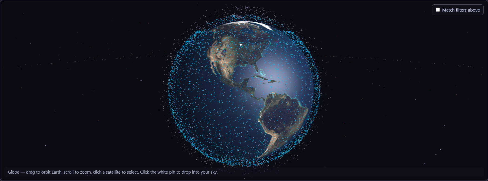
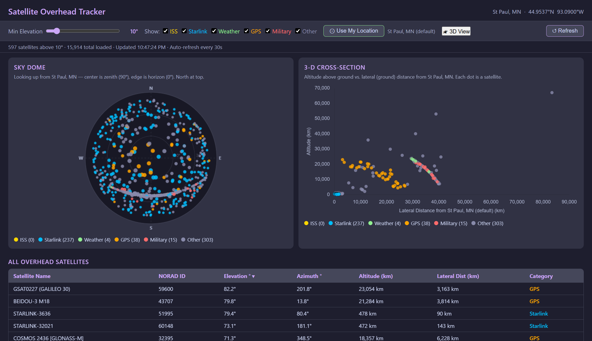
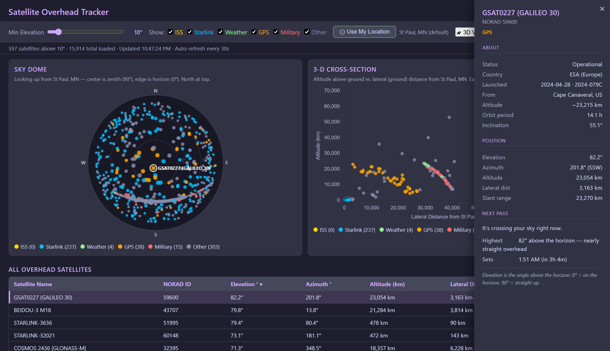
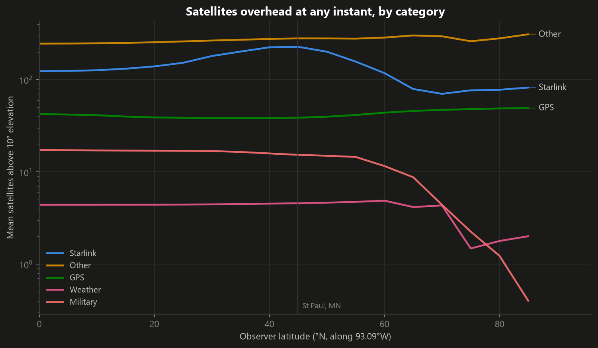
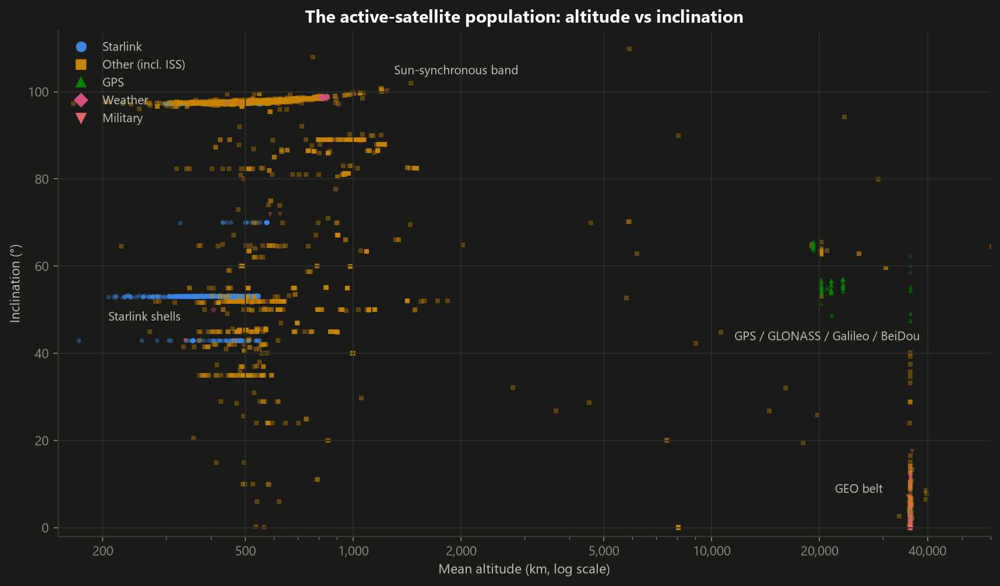

# Satellite Overhead Tracker

**Live app: [shaunak3000.github.io/satellite-tracker](https://shaunak3000.github.io/satellite-tracker/)**

[](https://shaunak3000.github.io/satellite-tracker/)

A single-page web app that shows every satellite above your horizon right now — computed entirely in your browser from live orbital data. No backend, no API keys: the page loads a daily-refreshed catalog of ~15,700 active satellites and propagates each orbit locally with SGP4.

## What's in the app

### Views

- **Sky Dome** — a polar plot of the sky as seen from your location: center is straight up (zenith), the edge is the horizon, north at top. Each dot is a satellite overhead.
- **3-D Cross-Section** — altitude above ground vs. lateral distance, a side-on view of everything passing over you.
- **3D View** — an interactive Three.js globe (real NASA Blue Marble texture) with the full satellite cloud in Earth-centered coordinates. Click your observer pin to drop into a ground-level planetarium view showing only the satellites above your horizon; click any dot to select it.
- **Table** — every overhead satellite with name, NORAD ID, elevation, azimuth, altitude, and range, sortable by any column.



### Selection & detail drawer

Click any satellite (table row, sky-dome dot, or 3D point) to open a detail drawer with:

- Live position: elevation, azimuth, altitude, lateral distance, and range, updating in place.
- **Next-pass prediction** — when the satellite will next rise above 10°, where to look (compass direction), how high it will get, and how long it stays visible. Computed by stepping the orbit up to 36 hours ahead.
- **About** — status, country, launch date and site, perigee–apogee altitude, orbit period, and inclination, from the CelesTrak satellite catalog.



### Controls

- **Use My Location** — browser geolocation, with St Paul, MN as the silent default.
- **Min Elevation slider** — hide satellites low on the horizon.
- **Category filters** — ISS, Starlink, GPS, Weather, Military, Other. (Starlink is ~two-thirds of everything up there, so it gets its own toggle.)
- Positions recompute every 30 seconds; the catalog itself is cached in your browser for 24 hours.

## How it works

| Piece | Role |
| --- | --- |
| `index.html` | The entire app — UI, orbit propagation, and all three visualizations in one file |
| `fetch_tles.py` | Fetches TLEs for all active satellites from [CelesTrak](https://celestrak.org/) and enriches them with SATCAT metadata (country, launch, orbit) in one pass |
| `tles.json` | The resulting catalog, committed daily by CI |
| `.github/workflows/fetch_tles.yml` | GitHub Action that runs the fetch every day at 06:00 UTC |
| `analysis/` | Orbit-analytics notebook: full-catalog SGP4 coverage simulation (see below) |

Orbit propagation uses [satellite.js](https://github.com/shashwatak/satellite-js) (SGP4) against each satellite's two-line element set. Charts are [Chart.js](https://www.chartjs.org/); the globe is [Three.js](https://threejs.org/), lazy-loaded only when you open the 3D view. Satellites are identified by NORAD catalog number throughout (names collide; catalog numbers don't). Debris and spent rocket bodies are filtered out at both fetch time and load time.

Because TLE accuracy decays from its epoch, the catalog is refreshed once a day — matching how often the upstream data meaningfully changes — and the page serves stale-but-fine data from cache between refreshes.

## Orbit analytics

Beyond the live view, [`analysis/coverage.ipynb`](analysis/coverage.ipynb) asks the statistical
version of the tracker's question: **how many satellites are overhead at any instant, and how
does that depend on where you live?** It propagates all ~15,900 orbits with SGP4 for a simulated
day at 60-second resolution, with observers placed every 5° of latitude.



A few of the findings:

- **"Other" beats Starlink at every latitude** despite Starlink being 67% of the catalog —
  high-altitude satellites linger above the horizon for hours while a 550 km Starlink crosses
  the sky in minutes. Population and presence are different things.
- **Starlink coverage peaks near 50–55°N**, the density edge of its 53°-inclination shells,
  then collapses toward the poles.
- **Navigation is engineered flat**: the GNSS constellations hold a near-constant ~40
  satellites above 10° from equator to pole — flatness is the design spec.
- **Geostationary satellites have zero passes** — always up, until Earth's curvature hides
  them entirely past ~75°N. (The notebook's GEO pick is position-aware: it discovered that
  GOES 14, the in-orbit spare, has drifted to ~131°E and never rises over Minnesota.)

The notebook also maps the whole population by altitude and inclination — every cluster is a
different engineering answer to "where do you want to be over Earth?":



## Running locally

It's a static page: clone the repo and open `index.html`, or serve the folder with any static server:

```sh
python -m http.server
# → http://localhost:8000
```

Committing to `main` is the deploy — GitHub Pages serves the repo root directly.
